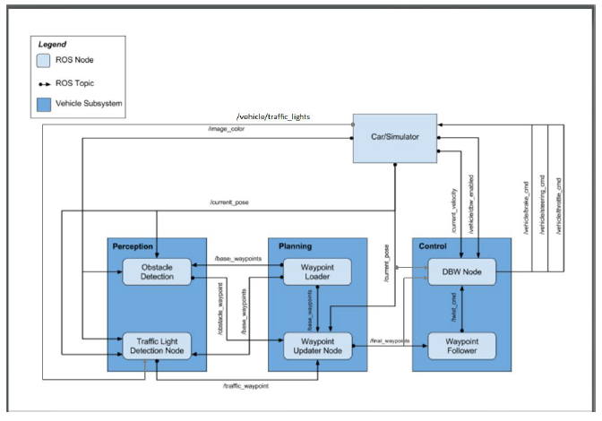
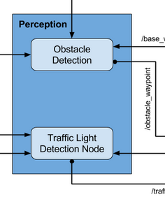
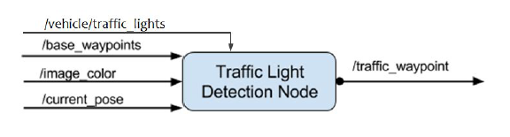
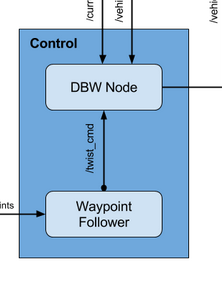
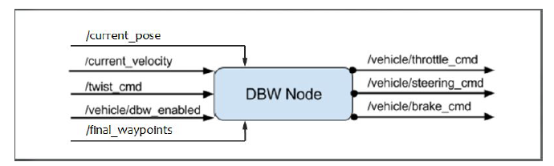
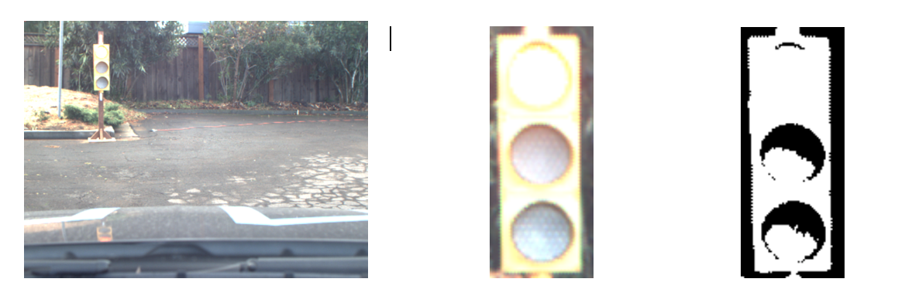
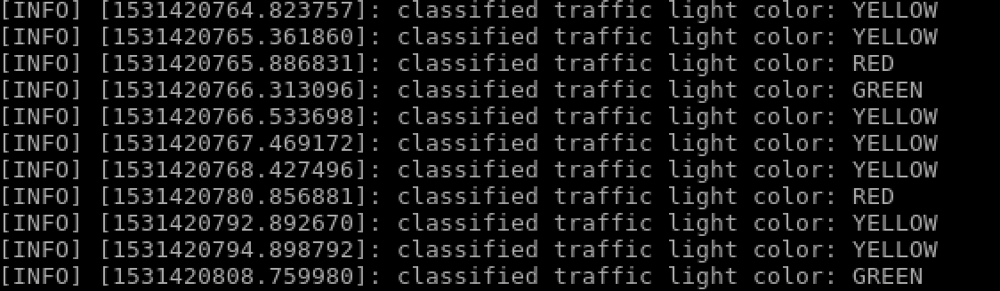
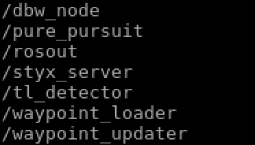
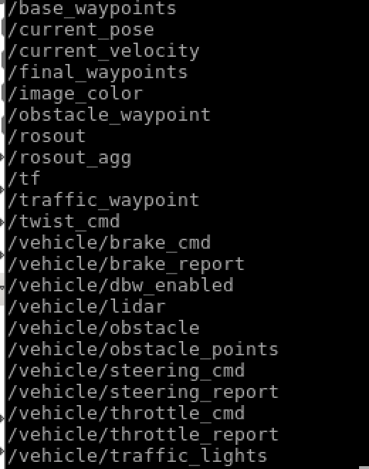

# Escargo CarND-Capstone project write up

## 0. Team Members
1. Olaf Beesdo, email: olaf_a75@web.de, slack user: @Olaf
2. Alexander Fuchs, email: fuchs.al@web.de, slack user: @A-F
3. Robert Harbach, email: robgineer@gmail.com, slack user: @rob
----------

## 1. Introduction
In the last project oft he Self-Driving-Car engineer Nanodegree course (Capstone) we implemented a ROS (Robotics Operating System) to help the Udacity car “Carla” maneuver autonomously on a test route. The speed was limited to 10mph for safety reasons. 
This capstone project brought together several aspects of the SDC Nanodegree promising Perception, Planning and Control.
First, the code is tested on the simulator and then we ran it on Carla. The code is written using the  ROS framework which works on the simulator and as well on Carla.

## 2. Architecture
To-Do insert architecture images

The system architecture comprises three subsystems.

- Perception
- Planning
- Control

The subsystems are joint by ROS topics. For example we publish to the topic vehicle/taffic_lights from the traffic light classifier to get the proper traffic light information from the camera input image to the planning and control node.

## 3. Implementation

### 3.1 Perception

The Perception subsystem takes sensor data, more precise camera images, and produces meaningful information such as the traffic light state (red/yellow/green).

As shown the Perception subsystem has two ROS nodes, the Obstacle Detection and Traffic Light Detection node. The Obstacle Detection node is not required for the Capstone project as of now. The Traffic Light Detection node comprises of two parts

1. Detect traffic lights in input camera image
2. Classify the color of the found traffic light

The mentioned parts are described in more detail hereafter.

#### 3.1.1 Traffic Light Detector

The Traffic Light Detector part takes the inputs as shown above to detect traffic lights in the camera input images (/image_color).
To detect the traffic lights we used a pre-trained network Single Shot Multibox Detector (SSD mobile v2). The frozen graph is loaded in the model and images are fed directly throught the graph. The traffic light detection by usage of the described pre-trained model showed a good performance.

More details can be found the the following Jupyter Notebook
https://github.com/robgineer/Traffic_Light_Detection/blob/master/SSD_extraction.ipynb

#### 3.1.2 Traffic Light Classifier
The Traffic Light Classifier part classifies the color of the found traffic light. For the simulation the classification is not mandatory. The information can be obtained from the simulator (/vehicle/traffic_lights). For implementing our code on Carla the traffic light classification is required. The following approach was used to build a traffic light classification:
For classification we implemented SqueezeNet

The classifier is described in detail in the following jupyter notebook of our team repo:
https://github.com/azumf/CarND-Capstone_TL_Classifier/blob/master/Escargo_classifier_v2_carla.ipynb

We wanted to have a performance comparison of different model approaches but unfortunately this task had to be cancelled due to team member quit.

Once the classification is done as described above, we publish the waypoints of the stop line closest to the classified red traffic light on the /traffic_waypoint topic. The information will be used by the Waypoint Updater node to regulate the car's velocity to bring the vehicle to a stop without jerk.

### 3.2 Planning

The Planning subsystem reads in the outputs of the file data in simulator modus or radar/lidar sensor data in real road application on Carla. The Perception subsystem outputs the traffic_waypoint and obstacle_waypoint information. The obstacle_waypoint functionality is not covered in this document since it is not required for the project (might be added in the future).

The Waypoint Loader reads in the waypoint values, position x, y & z and yaw information from a file (simulator) or sensor data (Carla). 

MORE INFOS...

The Waypoint Updater node shown above as two functions.

#### 3.2.1 Waypoint updater
Gets all waypoints from the CSV file + a current pose of the vehicle and outputs the next 200 waypoints ahead of the vehicle.

### 3.3 Control

The Control subsystem takes the path planned by the Planning subsystem described before and issues the commands for throttle/acceleration, brake and steering of the vehicle. 
It is a DBW Node, DBW stands for drive-by-wire and means the throttle/brake/steering of the vehicle can be controlled electronically through software without a mechanical joint.

As shown in the diagram the Control subsystem comprises two ROS nodes, the Waypoint Follower and the DBW Node. The Waypoint follower is already implemented in the provided project code. It takes the waypoints by the Planning subsystem as inputs and outputs a target linear and angular velocity by taking into account obstacles like traffic lights.

Within the DBW node the described target linear and angular velocities (/twist_cmd) are processed with the current velocity (/current_velocity), current location (/current_pose) of the vehicle and the final waypoints (/final_waypoints) as inputs and fed into a stanard PID controller, described below.

#### 3.3.1 PID-Controller

The PID controller produces actuation values for throttle, brake and steering for DBW. Besides current velocity and twist_cmd we also pass in the DBW status (enabled/ not enabled), check the DBW node figure.

The P, I and D parameters play different roles in the control system:

- P: generatres a steering correction **proportional** to the cross track error (cte). 

## 4. Testing
Once the car was able to finish one whole track using the standard simulation, we have started the "lot" simulation for testing the maximum angle and the ability to drive a full circle.
The result implies a properly working DBW node. 

In addition to that, we have started to test the traffic light detection using a provided rosbag

 

The results revealed that our traffic light detection was not accurate on the carla test track as the light conditions were too poor for the SqueezeNet to detect traffic light colors:

Hence, we have implemented a second traffic light status detection algorith using a more analytic approach.

The idea was to identify traffic light states is based on the fact that every active light bulb has a higher illumination and therefore Procedure:
1. Load image
2. Convert image into grayscale
3. Extract a black and white image based on a threshold
4. Divide b/w image into three parts (representing the light bulbs)
5. Count the amount of pixes !=0
5. Compare the amount of white pixels
6. Derive active traffic light state 

The processing order is shown below

For more details refer to 
https://github.com/robgineer/Traffic_Light_Color_Classifier/blob/master/simple_color_detector.ipynb
 
The result implied a much more accurate traffic light status detection as shown in the resulting LOG output

## 5. Appendix

### 5.1 ROS Nodes

$ rosnode list

shows following ros nodes:

### 4.2 ROS Topics

$ rostopics list

shows following ros topics:

